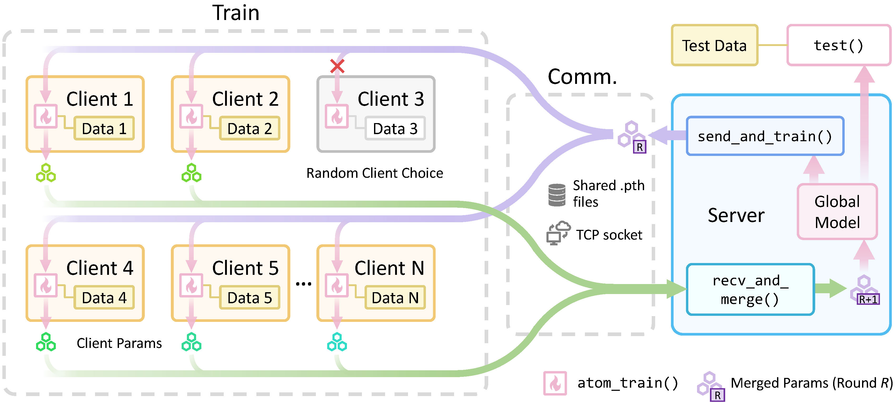

## CS3511-Federated-Learning

Personal Project of SJTU CS3511, 2024 Spring

---

In this project, we developed a modular, generic framework to simulate horizontal federated learning, ensuring data privacy through file read/write operations or socket transmission of parameters, and parallel processing to accelerate training. Our experiments demonstrated that the framework can successfully train classification models on the BloodMNIST dataset. Please refer to the report (see `report.pdf`) for specific implementation details.



### Clone

```bash
git clone git@github.com:UNIkeEN/CS3511-Federated-Learning.git
```

### Usage

In this project, YAML files are used to input configurations, which include paths for datasets, models, and logs, as well as training strategies and hyperparameters. 

```bash
cd CS3511-Federated-Learning
python main.py --config <path/to/config/file>
```

For the three stages specified in the project requirements (see `misc/problem set.pdf`), annotated configuration file templates can be found in the `configs/` directory. For example, to run stage 1 with the predefined settings, you may enter the following command:

```bash
python main.py --config configs/stage1.yaml
```

### Code Structure
```
.
├── .gitignore
├── client.py       # client code for stage 3 (online pipeline)
├── dataset.py
├── LICENSE
├── main.py         # program entry
├── pipeline.py     # core code component, including implementation of three stages
├── README.md
├── report.pdf      # report
├── utils.py        # contains some utility functions
├── configs
│   ├── stage1.yaml
│   ├── stage2.yaml
│   └── stage3.yaml
├── misc
│   ├── pipeline-of-fl-s.jpg
│   ├── problem set.pdf
│   └── 数据集使用说明.md
└── models
    ├── LeNet.py
    ├── MLP.py
    └── __init__.py
```